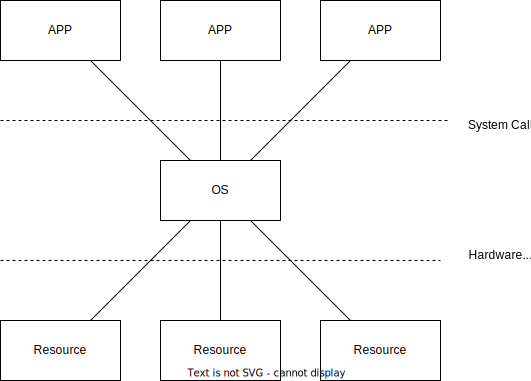

# Операционные системы

Пользователь взаимодействует с прикладными программами. Эти программы используют исходные данные, сохраненные на устройствах постоянной памяти, сохраняют результаты своих вычислений там же, промежуточные результаты хранят в оперативной памяти. Взаимодействуют с пользователем постредством терминальных устройств, т.е. решают много побочных задач, не связнанных с основной. Программы используют все ресурсы, к которым есть доступ.

Первая функция операционной системы  - абстрагирование прикладных программ от оборудования.

То есть операционная система предоставляет высокоуровневый интерфейс для доступа к аппаратному обеспечению.

Вторая функцмя операционной системы - планирование (диспетчеризация, распределение) ресурсов между потребителями.

Operating System - система _оперирующая_ чем-то.

Операционная система - комплекс программных средств, предназначенных для предоставления доступа к ресурсам и их диспетчеризации наиболее удобным и эффективным для пользователя способами.

В режиме ядра доступ к ресурсам полностью открыт. В пользовательском режиме доступ к ресурсам осуществляется только опосредовано - через ядро.

26:31